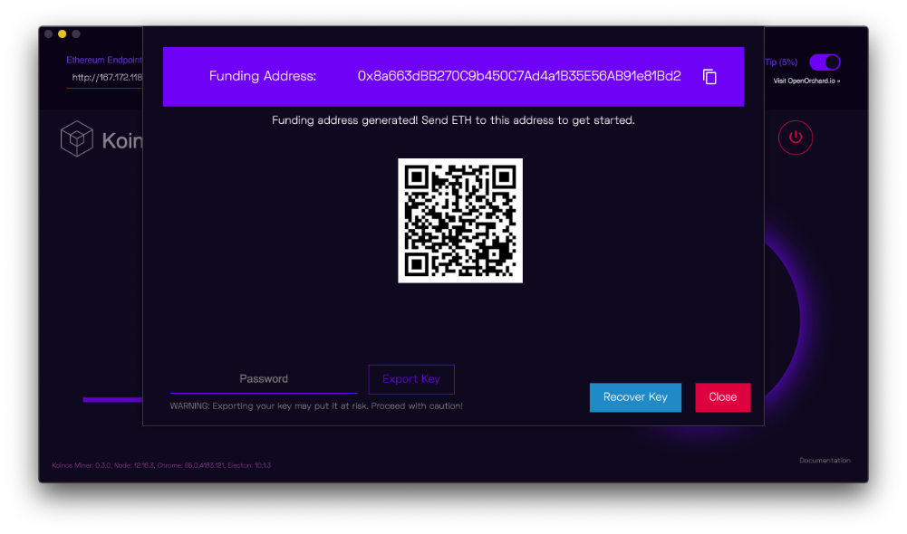
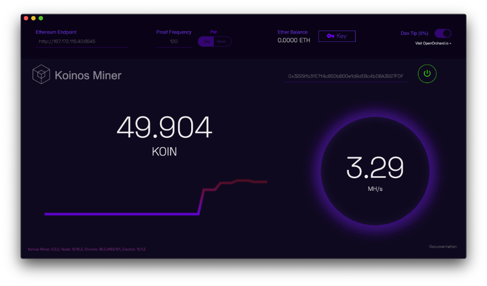
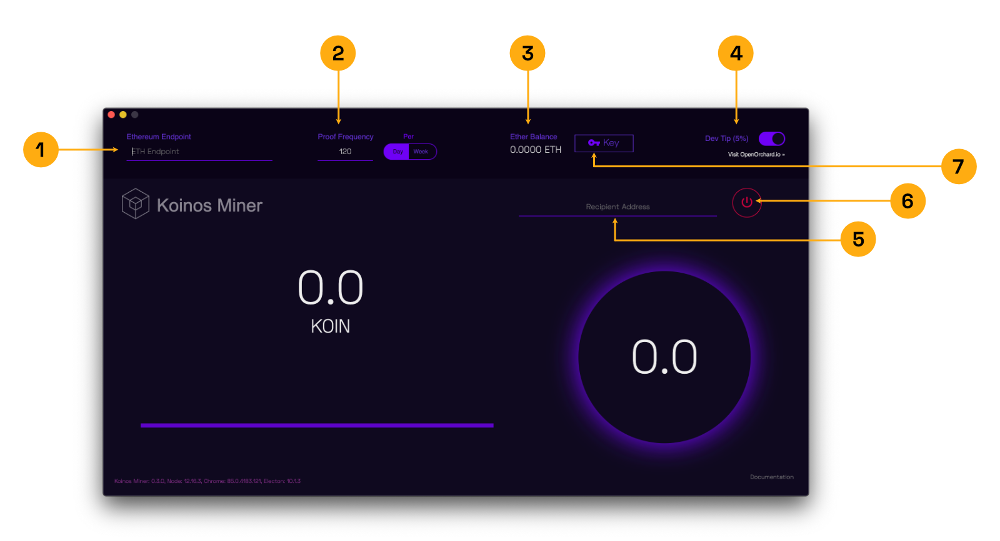

  

# Koinos Miner

## Table of Contents
  - [Installation](#installation)
  - [Getting Started](#getting-started)
  - [Koinos Miner Overview](#koinos-miner-overview)
    - [Ethereum Endpoint](#ethereum-endpoint)
    - [Proof Frequency](#proof-frequency)
    - [Ether Balance](#ether-balance)
    - [Dev Tip](#dev-tip)
    - [Recipient Address](#recipient-address)
    - [Power Button](#power-button)
  - [Key Management](#key-management)
  - [Mining Behavior](#mining-behavior)
  - [Koinos Airdrop](#koinos-airdrop)
  - [License](#license)

### Installation

Standalone **executables** for *Linux*, *macOS* and *Windows* are provided on
the [Releases](https://github.com/open-orchard/koinos-gui-miner/releases) page.
Download the package for your operating system and run the installer.

| Builds | Release | Date |
| ------ | ------- | ---- |
| Last   |  |  |
| Stable |  |  |

### Getting Started

Once installed click the Key button [(*Figure 1.7*)](#figure-1) in the navbar and follow the prompts to generate your private key and 12 word pharase (read the warnings carefully). Once the private key is generated you will have an ethereum address where you can send funds to in order to pay the transaction fees.  [(*Figure 0.1*)](#figure-0.1)  
  

  
  <em>Figure 0.1</em>

 
 

Enter the Ethereum address where the KOIN will be deposited once mined in the "Recepient Address" field. Adjust the proof frequency as desired and click the power button. Once the miner is connected to the network and mining the screen should display a hash rate and the graph will adjust accordingly. [(*Figure 0.2*)](#figure-0.2)  

  
  <em>Figure 0.2</em>

### Koinos Miner Overview

#### Ethereum Endpoint 
The Ethereum Endpoint enables the Koinos Miner to submit transactions for inclusion on the Ethereum blockchain. A user can choose to run their own Ethereum node using an application like `geth` or opt to use a publicly available Ethereum node. When running your own `geth` node, the user would provide the input `http://localhost:8545` where `8545` is the port number in which `geth` is listening. Using a publicly available endpoint simplifies the process of setting up the miner but one must keep in mind any rate limiting that may affect proof submissions.  
[(*Figure 1.1*)](#figure-1)

#### Proof Frequency
The Proof Frequency indicates how often the miner will attempt to find and submit proofs. Everytime a proof is found a transaction is submitted for inclusion on the Ethereum blockchain. Ethereum transactions are not free therefore the less frequently one submits proofs the less ether it will cost to mine KOIN. The frequency in which a user decides to submit proofs does not necessarily imply the amount of KOIN rewarded. When decreasing the proof frequency the miner will increase the difficulty which attempts to balance KOIN rewarded based on effort. For more information see [Mining Behavior](#mining-behavior).  
[(*Figure 1.2*)](#figure-1)

#### Ether Balance
The Ether Balance indicator shows the user the remaining balance of the funding address. Using the cost of the last proof submission, the indicator will attempt to approximate how much mining time is remaining before the funding account needs to be replenished.  
[(*Figure 1.3*)](#figure-1)

#### Dev Tip
Koinos is being developed by [Open Orchard, Inc](https://openorchard.io). There will be no Initial Coin Offering (ICO) or alternative form of token distribution. All tokens will be equitably distributed to all participants via the mining process. By tipping Open Orchard, you will contribute to the development of the Koinos project. OpenOrchard thanks you!  
[(*Figure 1.4*)](#figure-1)

#### Recipient Address
The Recipient Address is the Ethereum Address in which KOIN will be rewarded. It is recommended that the Recipient Address is different than the Funding Address. For more information on this topic [Key Management](#key-management).  
[(*Figure 1.5*)](#figure-1)

#### Power Button
The Power Button is used to toggle the miner on and off. When the user has supplied all the necessary configuration and presses the power button mining will begin, feedback will be presented to the user regarding any invalid parameters, or a countdown will be presented if the user attempts to mine before the predetermined start time.  
[(*Figure 1.6*)](#figure-1)

### Key Management
Koinos is using a memory hard proof of work for the initial distribution of the Koinos core token (KOIN). This mining takes place via smart contracts on Ethereum. To mine, you'll need some Ether and a couple of Ethereum addresses.
We recommend using two Ethereum addresses. One of them will be generated in the miner itself, and the other is created via another Ethereum wallet such as Metamask or MyEtherWallet.
Your Metamask address will be used as the destination for your KOIN as well as an intermediary account to fund your mining. Metamask has considerable [documention](https://metamask.zendesk.com/hc/en-us/articles/360028141672-How-to-send-deposit-tokens-to-your-MetaMask-Wallet) on how to use their software.
When you start the Koinos miner, click the `Keys` button in the top bar. This will open a dialogue to generate a key in the miner. You will want to write down the 12 word recovery phrase to prevent loss of access to the account. You can use the same 12 word recovery phrase to recover this address in Metamask.
Copy your address from Metamask and paste it in the address field on the main miner window.
With this configuration, you will pay for proofs with the account generated in the miner and send tokens directly to the account controlled by Metamask. Your KOIN will be controlled by a more secure key and Metamask can export that key, which will be required to redeem your KOIN when Koinos mainnet launches.
Finally, before mining, you will need to fund the miner. You can view the address of the key generated on the miner by clicking `Keys` again. We recommend funding the miner with minimal ETH as it is needed to mine.
The miner estimates how many proofs you can mine before running out so you can keep the miner topped off.  
[(*Figure 1.7*)](#figure-1)

  
  <em>Figure 1</em>

### Mining Behavior
Mining KOIN is a bit different than mining other cryptocurrencies. For starters, mining KOIN is separate from block production.
When mining for block production, you are only rewarded when you mine a block. There is a high amount of variance on the individual level, which mining pools help normalize.
Koinos mining does not support mining pools because it does not need mining pools to normalize variance. Because valid proofs do not generate blocks, there is no need to enforce a global total ordering on proofs, only a per address ordering. Each proof has a specified difficulty that determines how many hashes you are credited with when the proof is submitted. This is calculated as `(2^256 - 1) / difficulty` which is the expected number of hashes required to get a proof less than the difficulty.
It is useful to think in terms of proof frequency (i.e. how often do you want to submit a proof and "cash in" on your hashes). This is done by setting the proof frequency in the top bar. If you want to submit a proof every hour, then you would select 24 proofs per day. The miner monitors your system's hash rate and dynamically chooses a difficulty that targets your desired proof frequency.
The more often you submit proofs, the less variance you will have in terms of mining rewards. But there is a trade off. Each proof costs ETH in the form of gas costs. And each proof has the same cost regardless of how often you submit them. For example, submitting one proof every hours costs 24 times as much as submitting one proof a day, but will be credited with the same number of hashes because the difficulty for the longer frequency will be 24x more difficult. However, the proof frequency is not a guarantee, but an average over time. If you are mining for weeks on end, then lower frequencies may be sufficient, but if you only plan on mining for a short time, a higher frequency may be advantageous. Our recommendation is somewhere between 1 and 24 proofs per day (one proof per hour vs one proof per day) assuming you are interested in mining more long term. Ultimately it a question to determine how efficiently you want to use your ETH on mining.
Proof rewards are handled via an internal market maker that exchanges hashes for KOIN. Each proof submitted will mint KOIN in to the market maker at a predetermined diminishing rate. Over the course of 6 months, 100,000,000 KOIN will be minted. You are credited with hashes based on your proofs difficulty and buy KOIN with those hashes from the market maker. In this way, we do not need to track a global difficulty for proofs as is needed in block production. Rather each proof is worth a different amount of KOIN depending on the current print rate and demand for KOIN via mining competition.

### Koinos Airdrop
After the mining period, what next? Koinos is a new blockchain and KOIN currently exists as an ERC-20 on Ethereum.
Prior to launching Koinos, we will announce a snapshot time. The ERC-20 contract we are using supports creating a snapshot of all KOIN balances. To redeem your KOIN on Koinos, you will need to sign a transaction on Koinos using the Ethereum private key associated with the address holding the KOIN. We will provide simple tooling to generate and submit this transaction, but bear the requirements in mind when deciding which address(es) to hold your KOIN prior to the snapshot date.
We encourage you to sign up to the Koinos mailing list on [koinos.io](https://koinos.io/). We will be using this mailing list as the primary form of communication with KOIN holders prior to the snapshot, launch of Koinos, and airdrop.

### License
Copyright 2020 [Open Orchard, Inc.](https://openorchard.io)
Koinos GUI Miner is free software: you can redistribute it and/or modify
it under the terms of the GNU General Public License as published by
the Free Software Foundation, either version 3 of the License, or
(at your option) any later version.
Koinos GUI Miner is distributed in the hope that it will be useful,
but WITHOUT ANY WARRANTY; without even the implied warranty of
MERCHANTABILITY or FITNESS FOR A PARTICULAR PURPOSE.  See the
GNU General Public License for more details.
You should have received a copy of the GNU General Public License
along with Koinos GUI Miner.  If not, see <https://www.gnu.org/licenses/>.